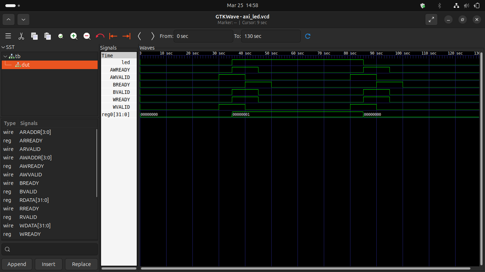

# AXI4-Lite LED Controller


A simple **AXI4-Lite slave peripheral** written in Verilog that controls an LED via a memory-mapped register. Designed to demonstrate AXI4-Lite handshake protocol, register-mapped I/O, and RTL simulation using open-source EDA tools.

---

## 📁 Project Structure

```
axi_led/
├── axi_led.v          # RTL design + self-checking testbench
├── axi_led.vcd        # Waveform dump (auto-generated on simulation)
├── axi_led_sim        # Compiled simulation binary (auto-generated)
└── README.md
```


##  Design Overview

### Module: `axi4_lite_slave`

| Feature | Details |
|---|---|
| Protocol | AXI4-Lite Slave |
| Registers | 4 × 32-bit (`reg0` – `reg3`) |
| LED Control | Bit 0 of `reg0` |
| Reset | Active-low (`rst_n`) |
| Clock | Single clock domain |

### Register Map

| AWADDR / ARADDR | Register | Description          |
|-----------------|----------|----------------------|
| `0x0`           | `reg0`   | LED control (bit 0)  |
| `0x4`           | `reg1`   | General purpose      |
| `0x8`           | `reg2`   | General purpose      |
| `0xC`           | `reg3`   | General purpose      |

The LED output is driven directly by `reg0[0]`:
```verilog
assign led = reg0[0];
```

### Port List

| Port        | Dir    | Width  | Description               |
|-------------|--------|--------|---------------------------|
| `clk`       | input  | 1      | Clock                     |
| `rst_n`     | input  | 1      | Active-low reset          |
| `led`       | output | 1      | LED (= reg0[0])           |
| `AWADDR`    | input  | 4      | Write address             |
| `AWVALID`   | input  | 1      | Write address valid       |
| `AWREADY`   | output | 1      | Write address ready       |
| `WDATA`     | input  | 32     | Write data                |
| `WVALID`    | input  | 1      | Write data valid          |
| `WREADY`    | output | 1      | Write data ready          |
| `BVALID`    | output | 1      | Write response valid      |
| `BREADY`    | input  | 1      | Write response ready      |
| `ARADDR`    | input  | 4      | Read address              |
| `ARVALID`   | input  | 1      | Read address valid        |
| `ARREADY`   | output | 1      | Read address ready        |
| `RDATA`     | output | 32     | Read data                 |
| `RVALID`    | output | 1      | Read data valid           |
| `RREADY`    | input  | 1      | Read data ready           |

---

##  Testbench

The testbench (`tb`) is included in `axi_led.v` and runs two back-to-back AXI write transactions with self-checking assertions:

| Step | Transaction | Expected Result |
|------|-------------|-----------------|
| 1    | Write `0x1` → address `0x0` | `LED = 1` ✅ |
| 2    | Write `0x0` → address `0x0` | `LED = 0` ✅ |

**Expected console output:**
```
VCD info: dumpfile axi_led.vcd opened for output.
LED = 1 (should be 1)
LED = 0 (should be 0)
axi_led.v:168: $finish called at 130 (1s)
```

---

## ▶️ How to Simulate

### Requirements

- [Icarus Verilog](https://steveicarus.github.io/iverilog/) — `iverilog` + `vvp`
- [GTKWave](https://gtkwave.sourceforge.net/) — waveform viewer (optional)

### Steps

```bash
# 1. Clone the repository
git clone https://github.com/<your-username>/axi_led.git
cd axi_led

# 2. Compile
iverilog -o axi_led_sim axi_led.v

# 3. Run simulation
vvp axi_led_sim

# 4. View waveform (optional)
gtkwave axi_led.vcd
```

---

## 📊 Waveform


After simulation, open `axi_led.vcd` in GTKWave and add these signals to the wave view:

| Signal              | What to look for                              |
|---------------------|-----------------------------------------------|
| `led`               | Goes HIGH after first write, LOW after second |
| `AWVALID / AWREADY` | Handshake pulse during write address phase    |
| `WVALID / WREADY`   | Handshake pulse during write data phase       |
| `BVALID / BREADY`   | Write response acknowledgement                |
| `reg0[31:0]`        | `0x00000001` → `0x00000000` across two writes |

---


## 🛠️ Tools Used

| Tool           | Purpose                          |
|----------------|----------------------------------|
| Icarus Verilog | RTL compilation and simulation   |
| GTKWave        | VCD waveform viewer              |
| VS Code        | HDL editing and Git integration  |
| Ubuntu (Linux) | Simulation environment           |

---
